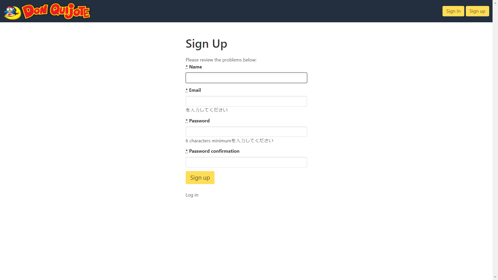

**E-Commerce Ruby Advacer**

**Authors:**

_Khondokar Hashibul Islam___
_Joy Julian Gomes_

**Built with:**

- Ruby on Rails

**Requirements**** :**

- Ruby 2.5.5p157 (2019-03-15 revision 67260) [x64-mingw32]
- Rails 5.2.3
- Sqlite3
- Minimagick

#**Installation**** :**

- Open Cli in the root folder
- Run "bundle install"
- Run "rails server"
#

# If facing problem
  **Install this gem as per their respective github pages**
  - 'simple_form'
  - 'devise'
  - 'gravatar_image_tag'
  - 'carrierwave', '~> 2.0'
  - 'mini_magick'
#

# Screen Shots:

__
__
__
__
__
__
__

#