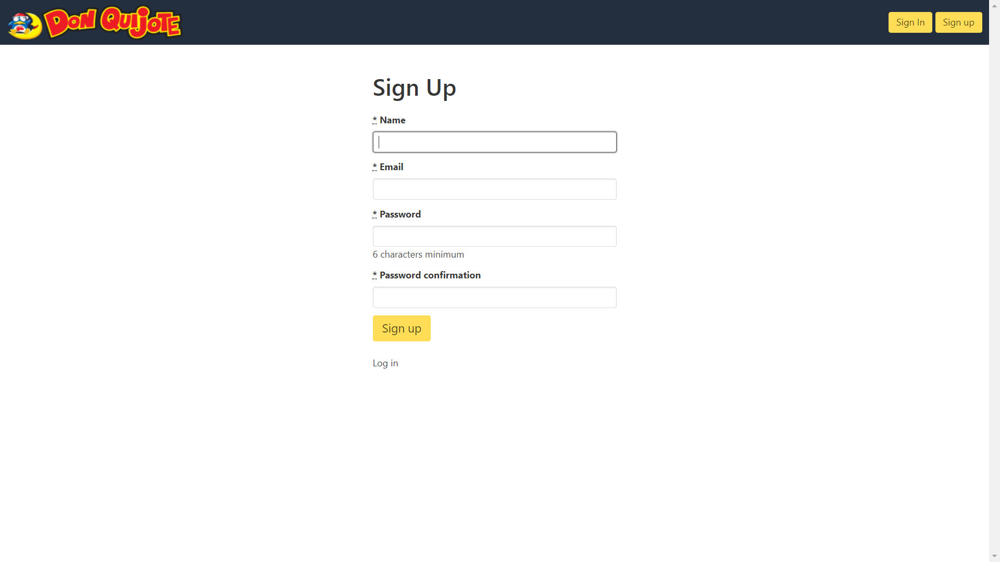
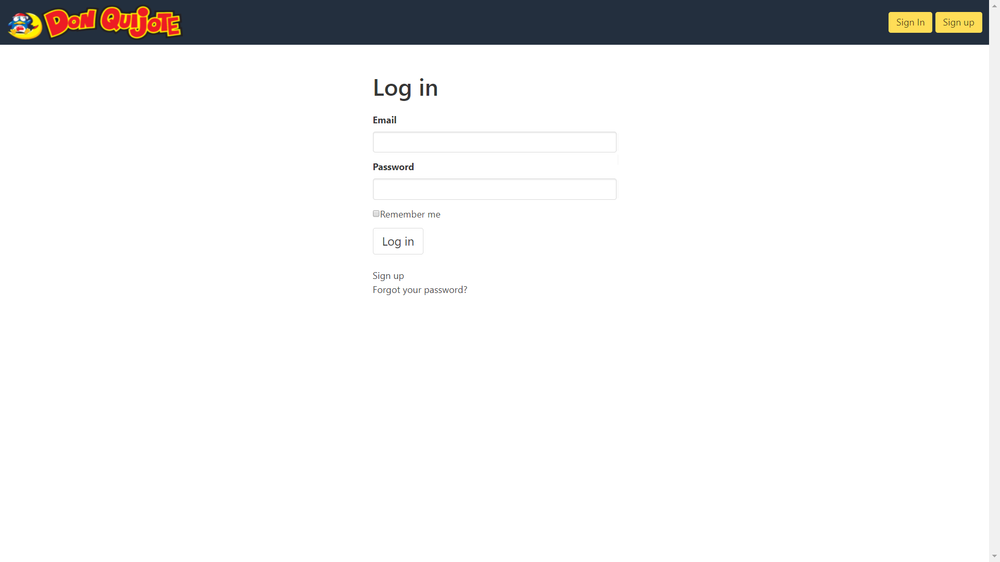
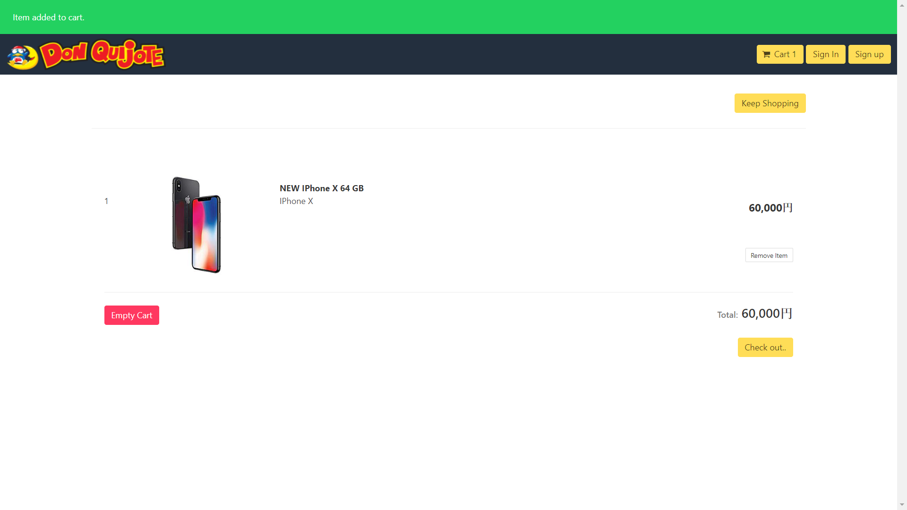
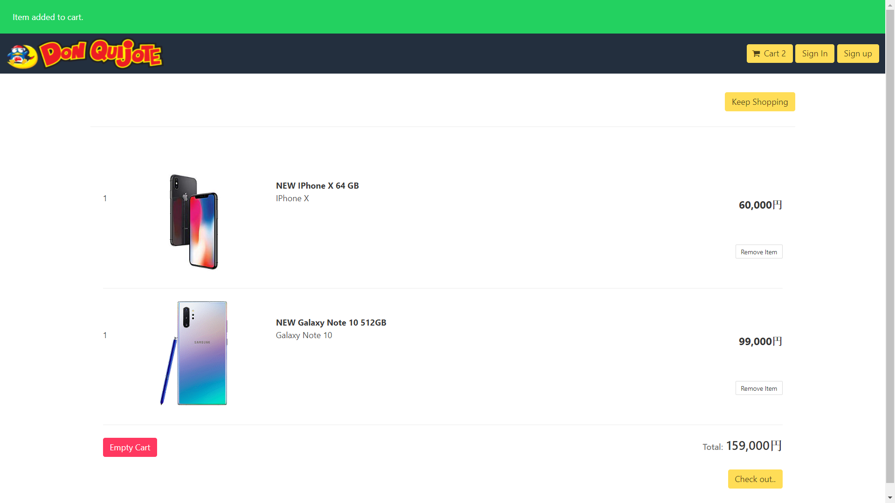

**E-Commerce Ruby Advacer**

**Authors:**

_Khondokar Hashibul Islam_
_Joy Julian Gomes_

**Built with:**

- Ruby on Rails

**Requirements**** :**

- Ruby 2.5.5p157 (2019-03-15 revision 67260) [x64-mingw32]
- Rails 5.2.3
- Sqlite3
- Minimagick

**Installation**** :**

- Open Cli in the root folder
- Run "bundle install"
- Run "rails server"

#

# Screen Shots:

